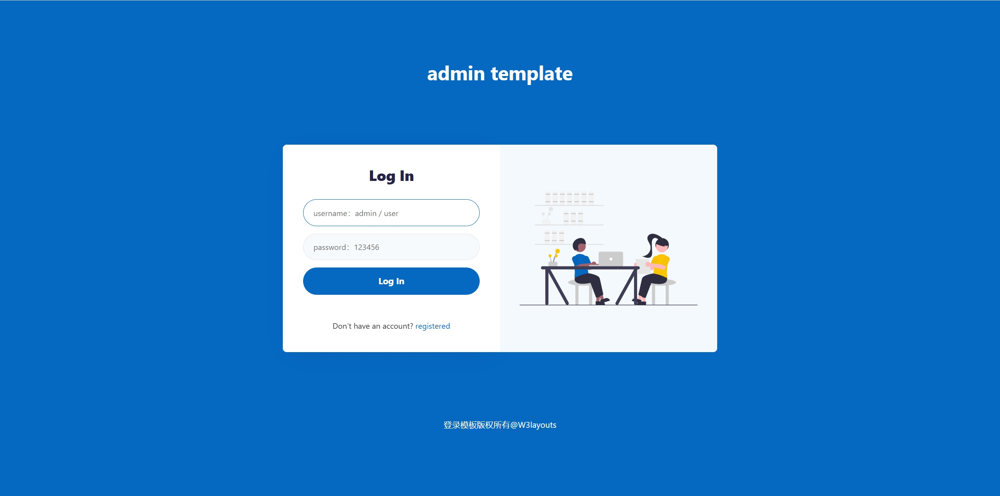
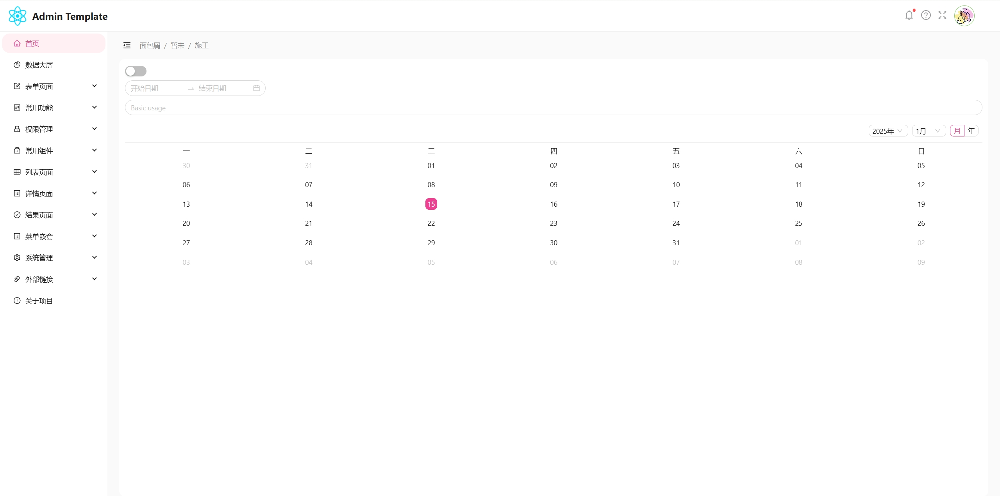
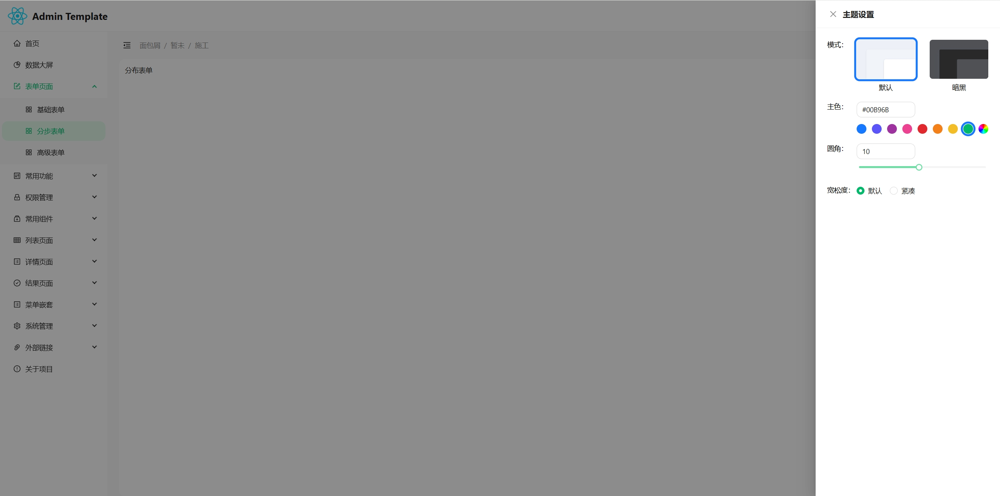

### 一个用于学习React而搭建的后台管理系统模板

### 主要技术栈：react18、vite5、TS、AntDesign5

### (项目尚未完善，但基本架构已搭建)

##### 主要特点：
yarn add --dev @types/lodash
npm i --save-dev @types/lodash
@types/redux-thunk
yarn add --dev @types/redux-thunk

- 纯前端，采用Mock模拟角色登录
- 轻装上阵，无多余页面结构以及样式
- 可扩展性强，可根据实际业务需求编写页面
- 支持动态路由，可根据角色菜单来筛选动态路由
- 采用Redux Toolkit进行状态管理，支持状态持久性存储
- 支持主题色配置，可自定义配置主题色、圆角大小以及暗夜模式的切换

##### 项目搭建环境：

- node v20.12.2
- npm v10.5.0

##### 推荐项目开发插件：

- ESLint
- Prettier
- Path Intellisense
- ES7 React/Redux/GraphQL/React-Native snippets

##### 项目运行：

- 安装依赖：npm install
- 运行项目：npm run dev

##### 项目截图：

